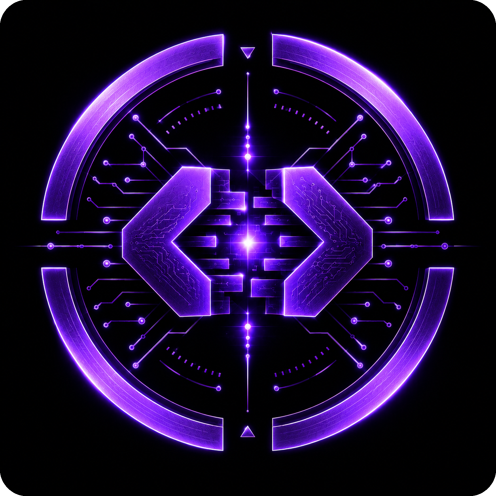

<p align="center">
  
</p>

<h1 align="center">zenvecha</h1>

<p align="center">
  <strong>Experimental runtime Linux kernel patching research.</strong>
</p>

<p align="center">
  <a href="https://ko-fi.com/rezky">
    
  </a>
</p>

---

## Status

**Phase 4 — ABI & Symbol Intelligence (v0.4.0)**

Kernel compatibility analysis. Read-only — no loading, no patching.

```bash
zenvecha doctor   # System readiness check
zenvecha inspect  # Kernel capability discovery
zenvecha analyze  # Development readiness assessment
zenvecha abi      # Kernel ABI & compatibility intelligence
```

---

## Mission

zenvecha researches safe, verifiable methods for applying runtime patches to the Linux kernel on desktop systems. The long-term goal is to reduce unnecessary reboots — not eliminate them.

### Goals

- Reduce unnecessary desktop reboots
- Safety first — never compromise system stability
- Open source (GPL-3.0-only)
- Desktop-first (Arch Linux / CachyOS, amd64, kernel 6.x)

### What zenvecha is NOT

- ❌ A universal "no reboot" solution for Linux
- ❌ A production server patching tool
- ❌ A replacement for proper kernel updates
- ❌ A bypass for kernel security mechanisms

---

## Quick Start

```bash
# Build
cargo build --release --locked

# Run gatekeeper checks (before commit)
./scripts/build.sh --check-all

# Install
./scripts/install.sh           # User install (~/.local/bin)
./scripts/install.sh --system  # System install (/usr/bin)

# Verify install
zenvecha --version
```

Release artifacts also ship quantum-resistant checksums (BLAKE2b + SHAKE256).
See [docs/VERIFY_RELEASE.md](docs/VERIFY_RELEASE.md) for verification instructions.

---

## Supported Platforms

| Platform    | Status        |
|-------------|---------------|
| Arch Linux  | ✅ Supported  |
| CachyOS     | ✅ Supported  |
| Kernel 6.x  | ✅ Supported  |
| amd64       | ✅ Supported  |
| ARM64       | ❌ Not yet    |
| Windows     | ❌ Never      |
| macOS       | ❌ Never      |

See [SUPPORT.md](SUPPORT.md) for details.

---

## Documentation

| Document | Description |
|----------|-------------|
| [docs/RULES.md](docs/RULES.md) | Engineering rules & philosophy |
| [docs/ROADMAP.md](docs/ROADMAP.md) | Development milestones |
| [docs/DESIGN.md](docs/DESIGN.md) | Architecture overview |
| [SECURITY.md](SECURITY.md) | Security policy & reporting |
| [SUPPORT.md](SUPPORT.md) | Platform support matrix |
| [TRADEMARK.md](TRADEMARK.md) | Trademark & IP |
| [CHANGELOG.md](CHANGELOG.md) | Release history |
| [docs/architecture.md](docs/architecture.md) | Detailed architecture |
| [docs/threat-model.md](docs/threat-model.md) | Threat analysis |
| [docs/limitations.md](docs/limitations.md) | Known limitations |
| [docs/adr/](docs/adr/) | Architecture Decision Records |

---

## License

GPL-3.0-only. See [LICENSE](LICENSE).

---

## Intellectual Property & Trademark

**zenvecha** is the exclusive intellectual property of
**rezky_nightky (oxyzenQ)**.

- Source code: licensed under **GPL-3.0-only** (see [LICENSE](LICENSE)).
- Name, logo, and branding ("the Marks"): governed by
  [TRADEMARK.md](TRADEMARK.md). The Marks are NOT covered by the GPL and
  are reserved by the owner.
- This project is **NOT for sale**. Unauthorized rebranding, relicensing,
  or source-code theft is strictly prohibited.

For trademark licensing or written permission, contact
**rezky_nightky (oxyzenQ)** — https://github.com/oxyzenQ.

---

© 2026 rezky_nightky (oxyzenQ). All rights reserved.
